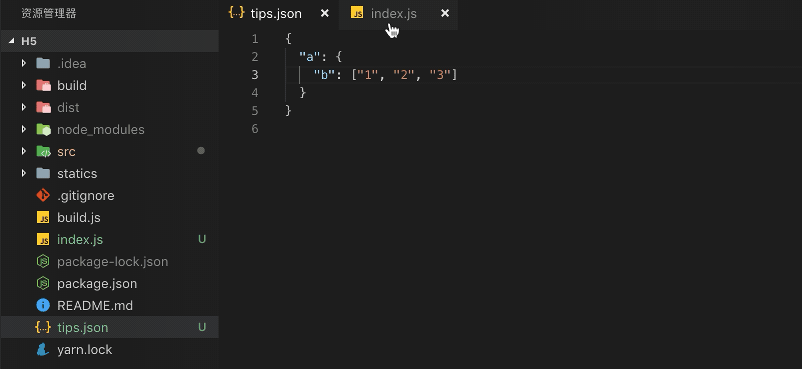
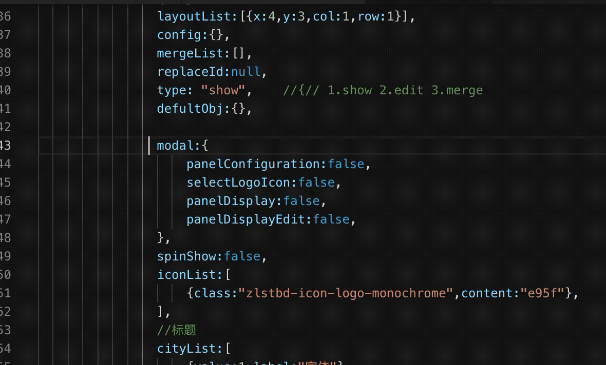
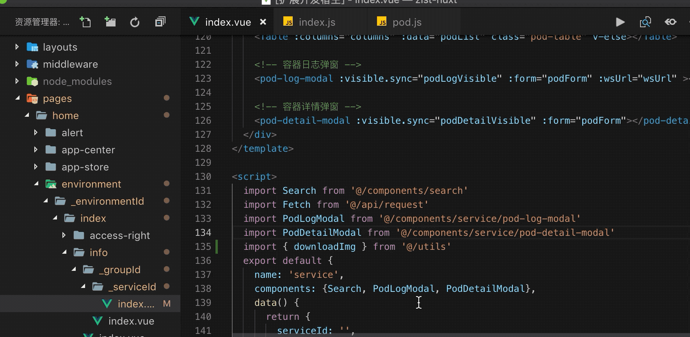

## release 2.0.1 notes
optimize tips for javascript

tips.json
```
{
  "plus": {
    "field": {
      "ROUTE_SPEASKER": ""
    },
    "method": {
      "getRecorder": {
        "params": ["url, id, styles, extras", "url, id, styles"],
        "returnType": "object",
        "return": "name"
      },
      "get": {
        "params": "url, id, styles, extras",
        "returnType": "object",
        "return": "name"
      }
    }
  },
  "name": {
    "field": {
      "hello": ""
    }
  }
}
```
### release 2.0.0 notes
support tips for javascript through local json file.
you can config like this:

tips result like this:


### release 1.7.2 notes
go to definition supports auto add index path

### release 1.7.1 notes
enhance go to definition in javascript file.
detail config see release 1.4.2 notes

### release 1.7.0 notes 
1. optimize choice for code block
2. add vue html attr select function. shortkey(**alt + x**)


### release 1.6.12 notes
optimize write snippet

### release 1.6.11 notes
optimize write snippet

### release 1.6.10 notes
add snippet for pagination and regExp for phone and email [prefix with reg-]

### release 1.6.9 notes
add snippets for element-ui

### release 1.6.8 notes
optimize jump definition function

### release 1.6.7 notes
optimize jump definition function

### release 1.6.6 notes
enhance select block ability for css select.

### release 1.6.5 notes
support select variable for obj and array.  shortkey(**alt + x**)


### release 1.6.4 notes
optimize select function

### release 1.6.3 notes
support global vue component jump

### release 1.6.2 notes
fixed relative path jump.

### release 1.6.1 notes
fixed relative path jump.

### release 1.6.0 notes
add select block fucntion. shortkey(**alt + x**) <br>
now support function, html tag, if, for, while, json, array block select


### release 1.5.1 notes
fix bug jump to definition with postfix

### release 1.5.0 notes
exchange rem to px or exchange px to rem for all file through command


### release 1.4.5 notes
rem px exchange, shortkey (**alt + z**)

rem px exchange setting


### release 1.4.4 notes
1. optimize go to definition function
2. optimize alias setting.

### release 1.4.3 notes
1. support path ignore index

2. iview Input add on-search method tip

 ### release 1.4.2 notes
support add alias through user settings. (use for jump to definition function)
alias support relative path

support iview, element-ui tag jump to definition


### release 1.4.1 notes
solve issue: 
[#2 Move to Definition function does not work](https://github.com/jiaolong1021/vue-helper/issues/2)

### release 1.4.0 notes
jump to definition function support self define component.
not supoort global component, must import by import or require.
the jump path support begin with @ and relation path


### release 1.3.10 notes
optimize jump to definition function

### release 1.3.9 notes
add iview page snippets. iv-page, iv-page-data, iv-page-method

### release 1.3.8 notes
close tag support tag attributu name include .

### release 1.3.7 notes
1. close tag support tag attributu name include : or @
2. iview split, cell, divider snippet.

### release 1.3.6 notes
close tag support tag attributu name include : or @

### release 1.3.5 notes
add iview icon tip, optimize close tag function

### release 1.3.4 notes
add iview modal snippets

### release 1.3.3 notes
add iview form, rules snippets

### release 1.3.2 notes
1. optimize go to definition method
2. add iview form code snippets.


### release 1.3.0 notes
property or method go to definiton in current page (keyword: cmd(mac) | ctrl(win))


### release 1.2.1 notes
optimize backspace handle

### release 1.2.0 notes
1. now support element tag see document through hover.

2. enhance tag close function

3. fix bugs

### release 1.1.8 notes
1. optimize attribute hover
2. add line empty delete funciton(enter backspace key).


### release 1.1.5 notes
optimize close tag function、 {{}} function, add change log.

### release 1.1.4 notes
optimize columns tip and message snippet show

### 1.1.3
---
auto close tag optinize, table columns attribute tips


### version 1.1.2
#### 1. vue hook function tip

#### 2. method completion snippets (keyboard shortcut: alt + shift + enter)

#### 3. autoclose html tag

#### 4. {{}} completion in vue template


### version 1.0.0
## basic functions introduce
---
### 1. see document detail through hover tag (**now only support iview**)


### 2. edit through tag name (friendly tip tag name about framework <code>element-ui</code>、<code>vux</code>、<code>iview</code>)


### 3. tag attribute tip


### 4. method tip (tip begin: element -> <code>el-</code>、iview -> <code>iv-</code>)


### questions feedback 
if you has any questions or good idea, you can feedback through issue.

**Enjoy!**