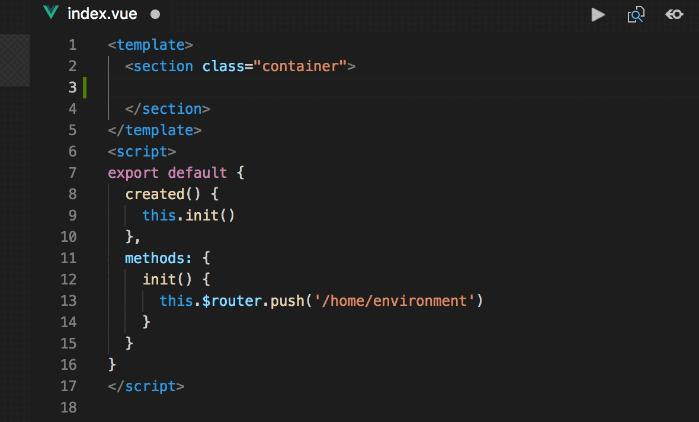
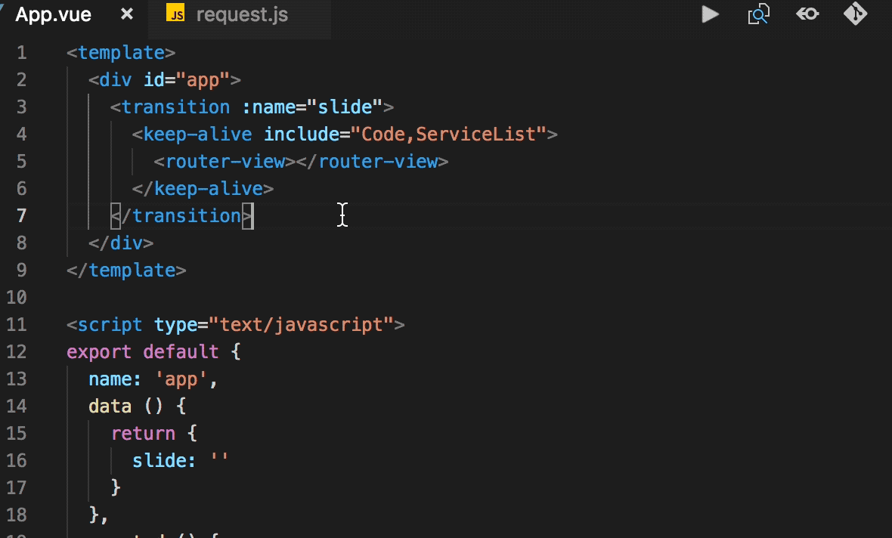
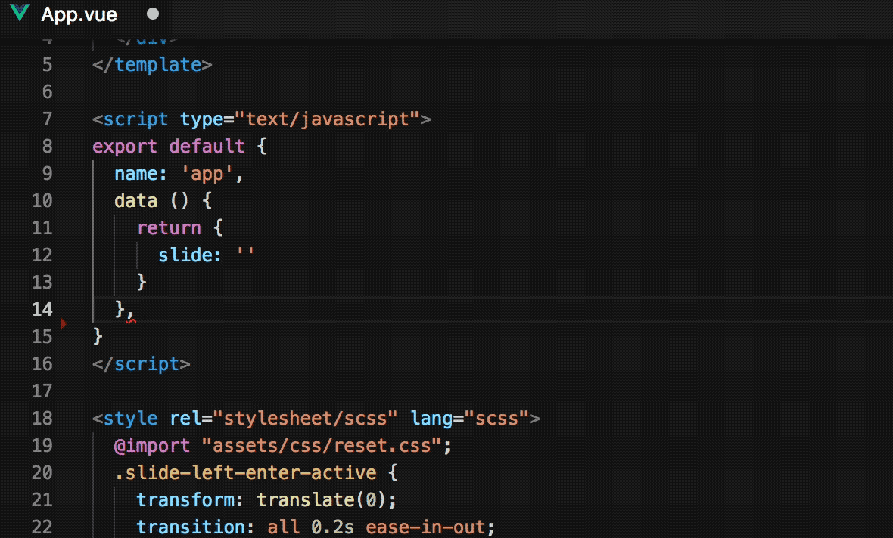
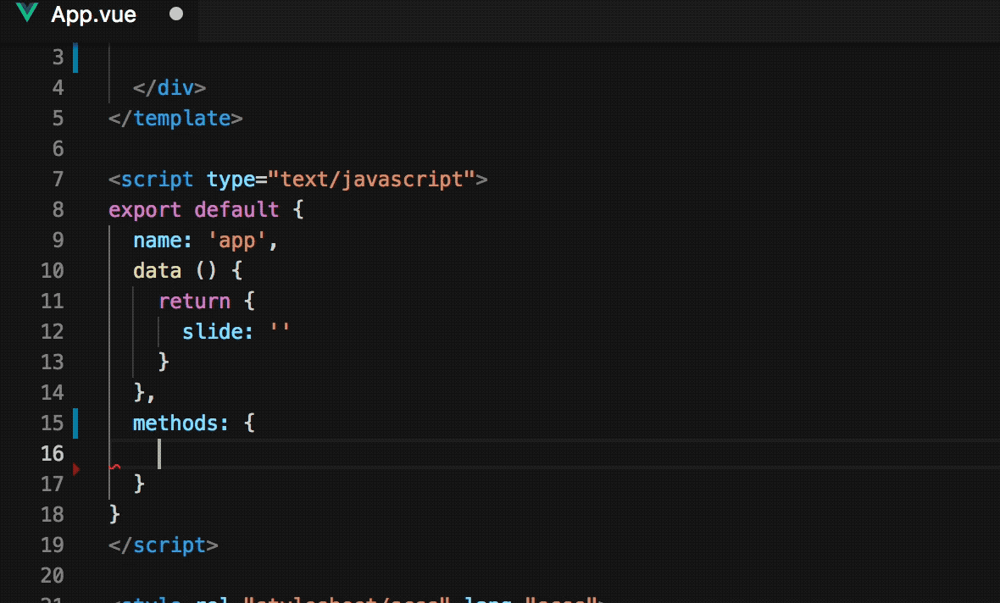
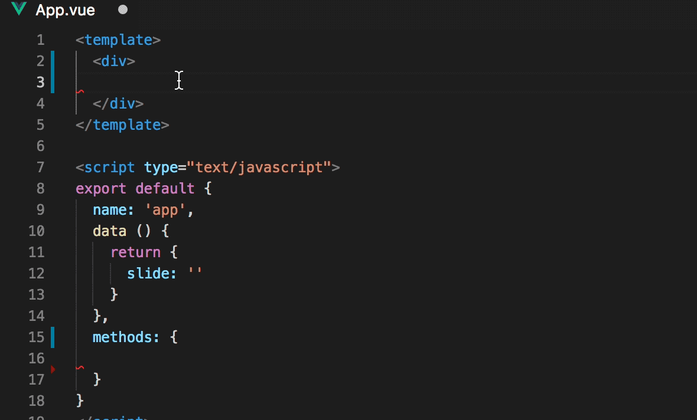
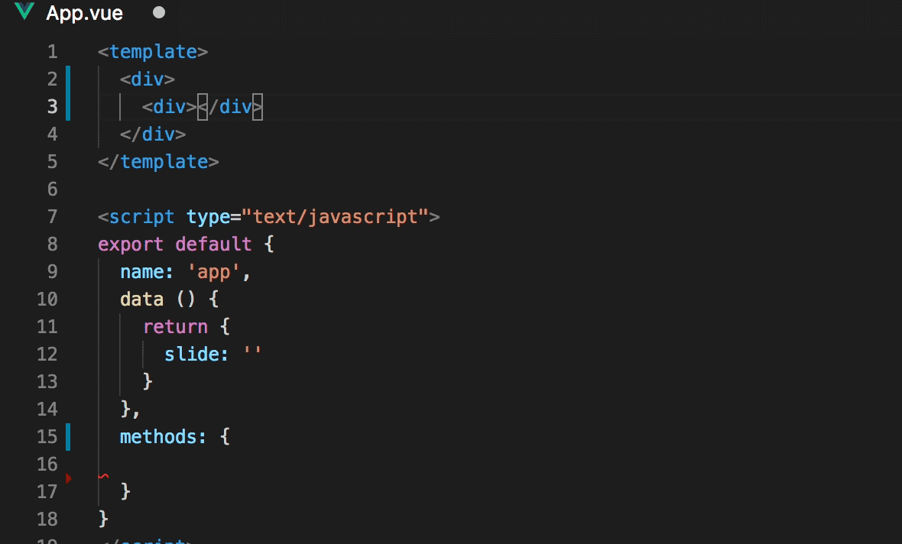

### release 1.3.8 notes
close tag support tag attributu name include .

### release 1.3.7 notes
1. close tag support tag attributu name include : or @
2. iview split, cell, divider snippet.

### release 1.3.6 notes
close tag support tag attributu name include : or @

### release 1.3.5 notes
add iview icon tip, optimize close tag function

### release 1.3.4 notes
add iview modal snippets

### release 1.3.3 notes
add iview form, rules snippets

### release 1.3.2 notes
1. optimize go to definition method
2. add iview form code snippets.

### release 1.3.0 notes
property or method go to definiton in current page (keyword: cmd(mac) | ctrl(win))

### release 1.2.1 notes
optimize backspace handle

### release 1.2.0 notes
1. now support element tag see document through hover.

2. enhance tag close function

3. fix bugs

### release 1.1.8 notes
1. optimize attribute hover
2. add line empty delete funciton(enter backspace key).

### release 1.1.5 notes
optimize close tag function、 {{}} function, add change log.

### release 1.1.4 notes
optimize columns tip and message snippet show

### 1.1.3
---
auto close tag optinize, table columns attribute tips

### version 1.1.2
#### 1. vue hook function tip

#### 2. method completion snippets (keyboard shortcut: alt + shift + enter)

#### 3. autoclose html tag

#### 4. {{}} completion in vue template

### version 1.0.0
## basic functions introduce
---
### 1. see document detail through hover tag (**now only support iview**)

### 2. edit through tag name (friendly tip tag name about framework <code>element-ui</code>、<code>vux</code>、<code>iview</code>)

### 3. tag attribute tip

### 4. method tip (tip begin: element -> <code>el-</code>、iview -> <code>iv-</code>)

### questions feedback 
if you has any questions or good idea, you can feedback through issue.

**Enjoy!**