# vue-helper
this plugin main enhance ability for write vue and extension for Element-UI, VUX, IVIEW
## detail function can see change log.

### release 1.7.2 notes
go to definition supports auto add index path

### release 1.7.1 notes
enhance go to definition in javascript file.
detail config see release 1.4.2 notes

### release 1.7.0 notes
1. optimize choice for code block
2. add vue html attr select function. shortkey(**alt + x**)
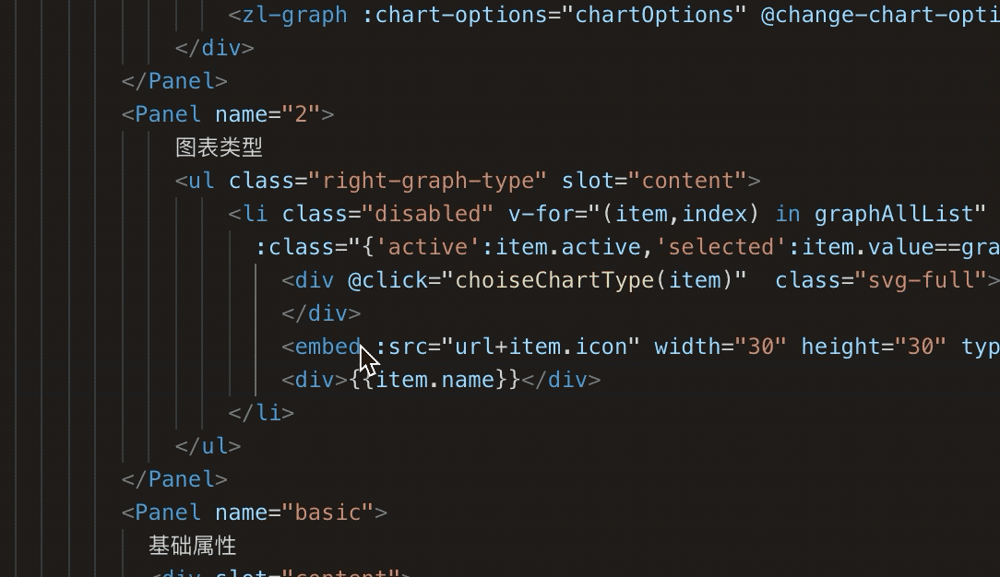

### release 1.6.9 notes
add snippets for element-ui [prefix with el-]

### release 1.6.0 notes
add select block fucntion. shortkey(**alt + x**)  
now support function, html tag, if, for, while, json, array block select
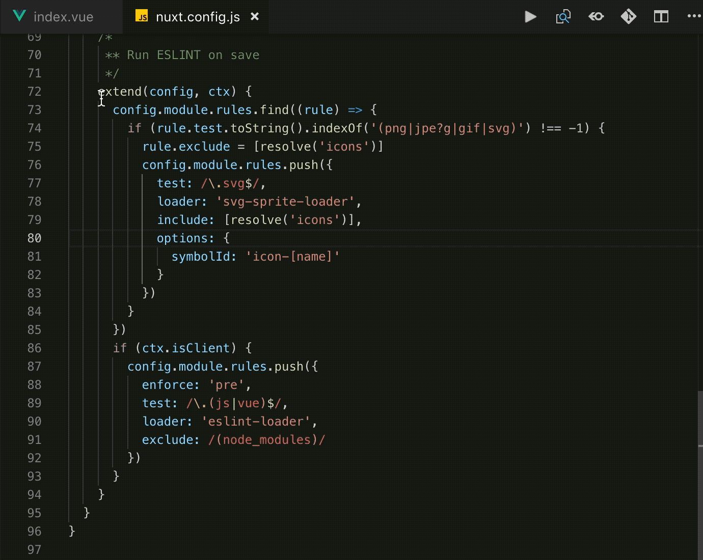

### release 1.5.0 notes
exchange rem to px or exchange px to rem for all file 
through command
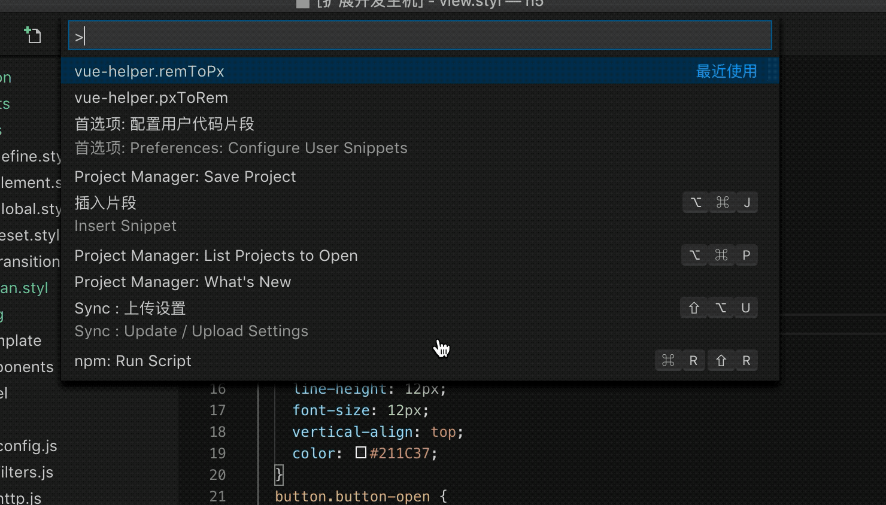

### release 1.4.5 notes
rem px exchange, shortkey (**alt + z**)
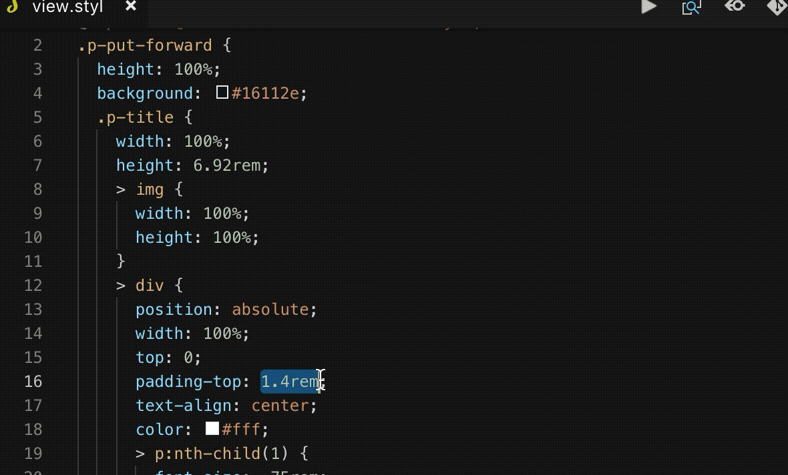
rem px exchange setting
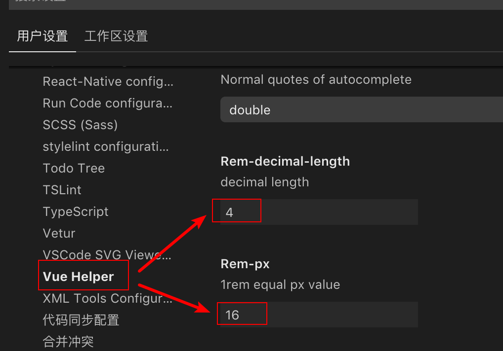

### release 1.4.2 notes
support add alias through user settings. (use for jump to definition function)
alias support relative path
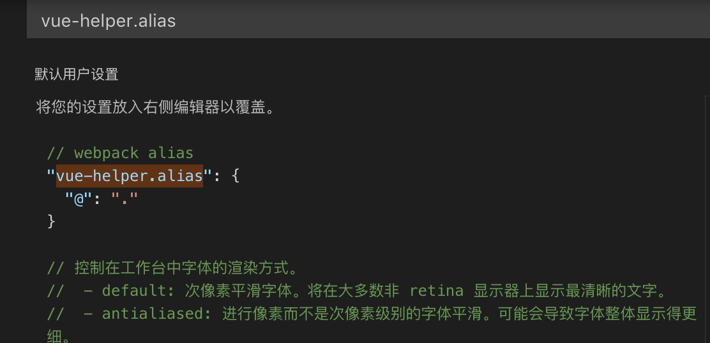
support iview, element-ui tag jump to definition
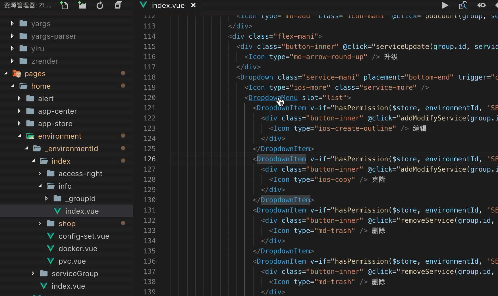

### release 1.4.0 notes
jump to definition function support self define component.
not supoort global component, must import by import or require.
the jump path support begin with @ and relation path
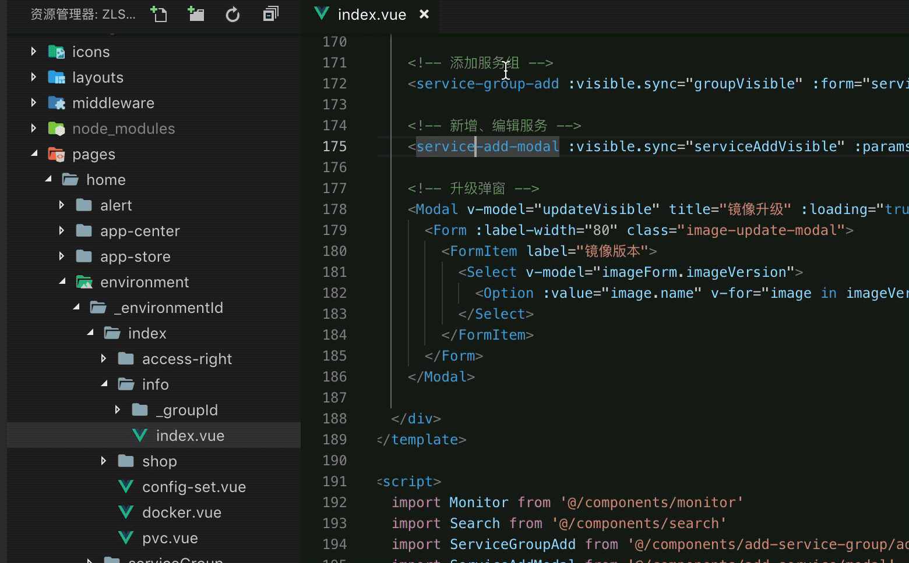

### release 1.3.1 notes
property or method go to definiton in current page (keyword: cmd(mac) | ctrl(win))
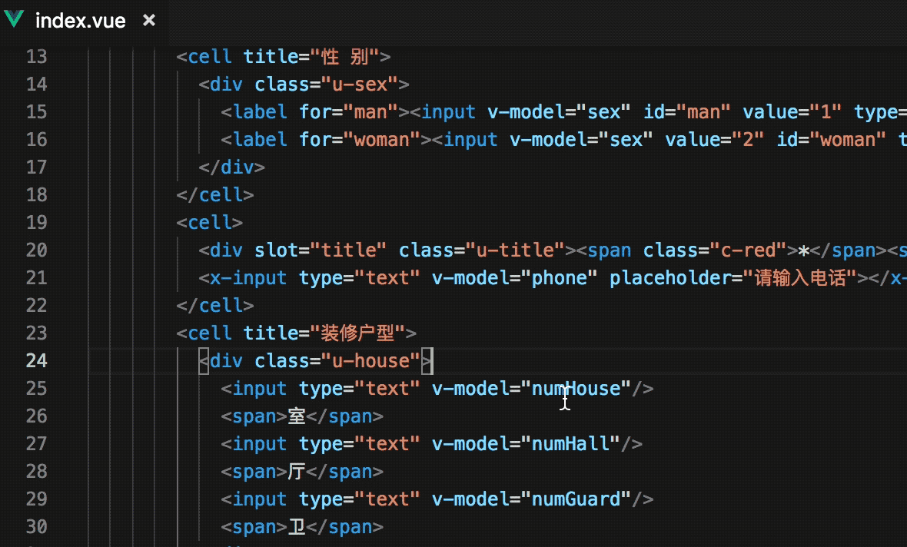

### release 1.2.0 notes
1. now support element tag see document through hover.
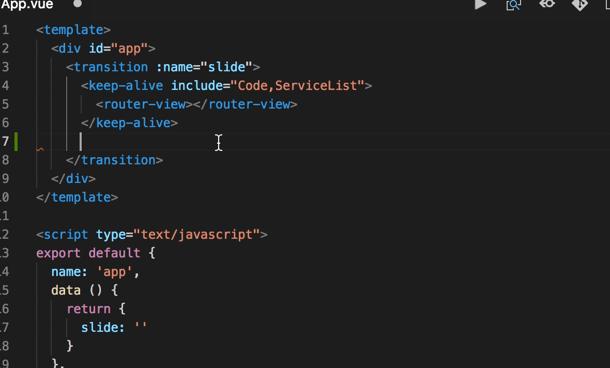
2. enhance tag close function
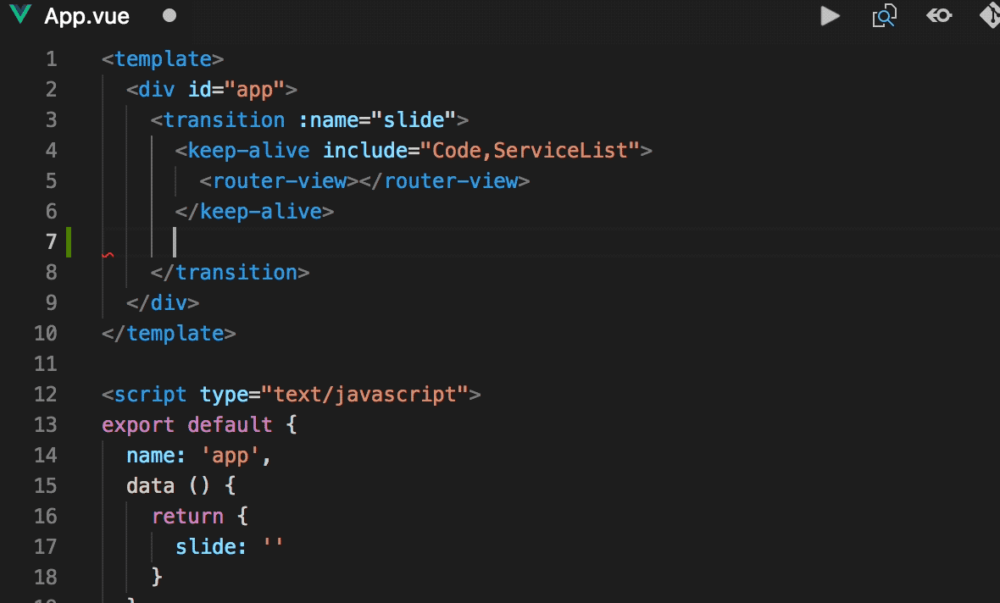
3. fix bugs

## basic functions introduce
---
### 1. see document detail through hover tag (**now only support iview**)

### 2. edit through tag name (friendly tip tag name about framework <code>element-ui</code>、<code>vux</code>、<code>iview</code>)

### 3. tag attribute tip

### 4. method tip (tip begin: element -> <code>el-</code>、iview -> <code>iv-</code>)

### questions feedback 
if you has any questions or good idea, you can feedback through issue.

**Enjoy!**
