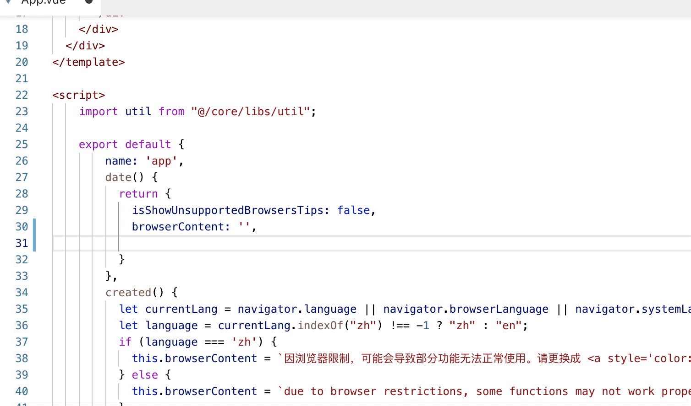
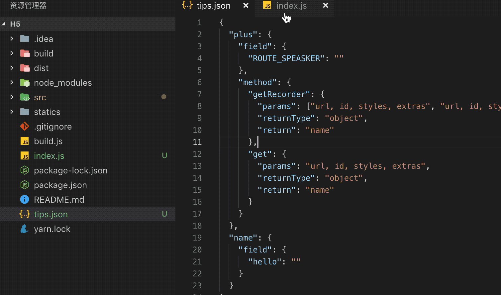
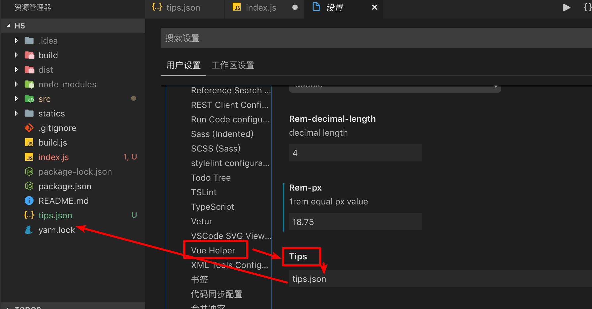

# vue-helper
this plugin main enhance ability for write vue and extension for Element-UI, VUX, IVIEW
## detail function can see change log.

## release 2.1.11 notes
+ enhance element-ui tips.
[el-timeline, el-timeline-item, el-divider, el-calendar, el-image, el-backtop, el-drawer]
+ object key value optimize. [alt + shift + enter]


## release 2.1.0 notes
add common code snippets for vue
all begin with v

| prefix | vue html snippet |
| --- | --- |
| vfor | v-for="(item, index) in items" :key="index" |
| vcomponent | &lt;component :is="componentId">&lt;/component> |
| vka | &lt;keep-alive>&lt;/keep-alive> |
| vtransition | &lt;transition>&lt;/transition> |
| vtg |  &lt;transition-group>&lt;/transition-group> |
| vrl | &lt;router-link>&lt;/router-link> |
| vrlt | &lt;router-link to=''>&lt;/router-link> |
| vrv | &lt;router-view>&lt;/router-view> |

| prefix | vue javascript snippet |
| --- | --- |
| vsilent | Vue.config.silent = true |
| veh | Vue.config.errorHandler = function (err, vm, info) {} |
| vwh | Vue.config.warnHandler = function (msg, vm, trace) {} |
| vextend | Vue.extend({template: template}) |
| vset | Vue.set(target, key, value) |
| vdelete | Vue.delete(target, key) |
| vdirective | Vue.directive({id, [definition]}) |
| vfilter | Vue.filter({id, [definition]}) |
| vcomponent | Vue.component({id, [definition]}) |
| vnt | Vue.nextTick({}) |
| vuse | Vue.use(plugin) |
| vmixin | Vue.mixin({mixin}) |
| vcompile | Vue.compile(template) |
| vdata | data() { return {} } |
| vmounted | mounted () {} |
| vbm | beforeMount () {} |
| vcreated | created () {} |
| vbc | beforeCreate () {} |
| vupdated | updated () {} |
| vbu | beforeUpdate () {} |
| vactivated | activated () {} |
| vdeactivated | deactivated () {} |
| vbd | beforeDestroy () {} |
| vdestroyed | destroyed () {} |
| vprops | props: {} |
| vpd | propsData: {} |
| vcomputed | computed: {} |
| vmethods | methods: {} |
| vwatch | watch: {} |
| vwo | key: { deep: true, immediate: true, handler: function (val, oldVal}) { } } |
| vdirectives | directives: {} |
| vfilters | filters: {} |
| vcomponents | components: {} |
| vmixins | mixins:[] |
| vprovide | provide: {} |
| vinject | inject: [] |
| vmodel | model: {prop: '', event: ''} |
| vrender | render(h) {} |
| vnew | new Vue({}) |
| vnt | this.$nextTick(() => {}) |
| vdata | this.$data |
| vprops| this.$props |
| vel | this.$el |
| voptions | this.$options |
| vparent | this.$parent |
| vroot | this.$root |
| vchildren | this.$children |
| vslots | this.$slots |
| vss | this.$scopedSlots.default({}) |
| vrefs | this.$refs |
| vis | this.$isServer |
| vattrs | this.$attrs |
| vlisteners | this.$listeners |
| vwatch | this.$watch(expOrFn, callback, [opitons]) |
| vset | this.$set(target, key, value) |
| vdelete | this.$delete |
| von | this.$on(event, callback) |
| vonce | this.$once(event, callback) |
| voff | this.$off(event, callback) |
| vemit | this.$emit(event, args) |
| vmount | this.$mount() |
| vfu | this.$forceUpdate() |
| vdestroy | this.$destroy() |

## release 2.0.4 notes
optimize block select function.

## release 2.0.1 notes
optimize tips for javascript

tips.json
```
{
  "plus": {
    "field": {
      "ROUTE_SPEASKER": ""
    },
    "method": {
      "getRecorder": {
        "params": ["url, id, styles, extras", "url, id, styles"],
        "returnType": "object",
        "return": "name"
      },
      "get": {
        "params": "url, id, styles, extras",
        "returnType": "object",
        "return": "name"
      }
    }
  },
  "name": {
    "field": {
      "hello": ""
    }
  }
}
```

### release 2.0.0 notes
support tips for javascript through local json file.
you can config like this:


### release 1.7.1 notes
enhance go to definition in javascript file.
detail config see release 1.4.2 notes

### release 1.7.0 notes
1. optimize choice for code block
2. add vue html attr select function. shortkey(**alt + x**)


### release 1.6.9 notes
add snippets for element-ui [prefix with el-]

### release 1.6.0 notes
add select block fucntion. shortkey(**alt + x**) <br>
now support function, html tag, if, for, while, json, array block select


### release 1.5.0 notes
exchange rem to px or exchange px to rem for all file 
through command


### release 1.4.5 notes
rem px exchange, shortkey (**alt + z**)

rem px exchange setting


### release 1.4.2 notes
support add alias through user settings. (use for jump to definition function)
alias support relative path

support iview, element-ui tag jump to definition


### release 1.4.0 notes
jump to definition function support self define component.
not supoort global component, must import by import or require.
the jump path support begin with @ and relation path


### release 1.3.1 notes
property or method go to definiton in current page (keyword: cmd(mac) | ctrl(win))


### release 1.2.0 notes
1. now support element tag see document through hover.

2. enhance tag close function

3. fix bugs

## basic functions introduce
---
### 1. see document detail through hover tag (**now only support iview**)


### 2. edit through tag name (friendly tip tag name about framework <code>element-ui</code>、<code>vux</code>、<code>iview</code>)


### 3. tag attribute tip


### 4. method tip (tip begin: element -> <code>el-</code>、iview -> <code>iv-</code>)


### questions feedback 
if you has any questions or good idea, you can feedback through issue.

**Enjoy!**
 