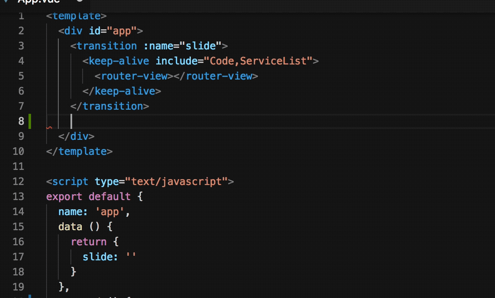
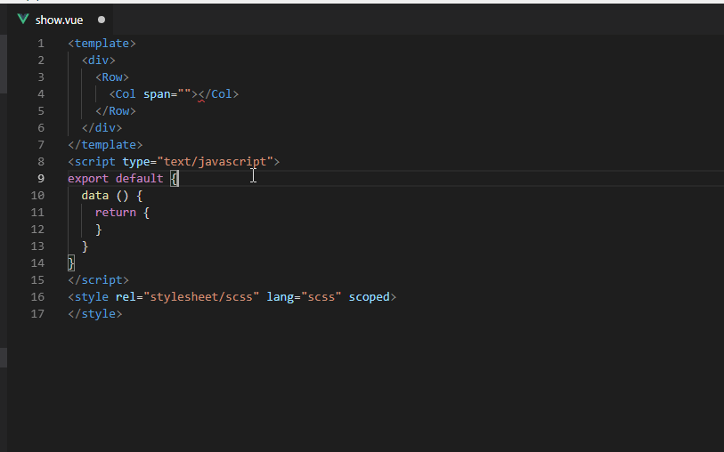
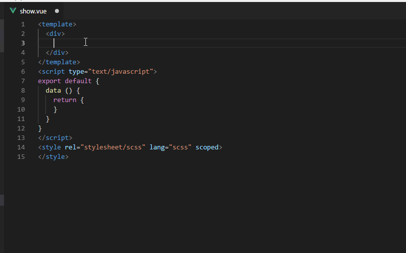
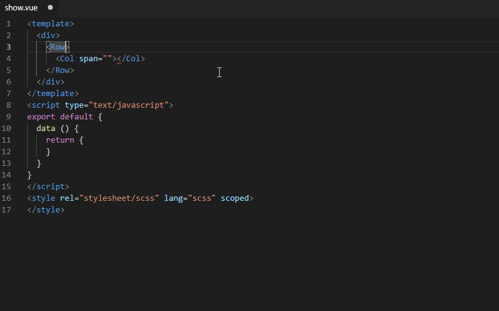
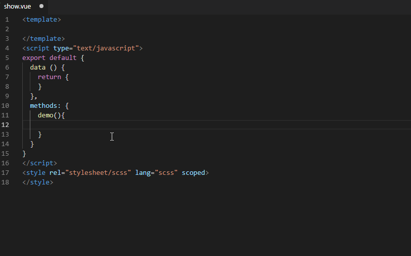

# vue-helper
this plugin main extend for element-ui, vux, iview2
### release 1.1.3 notes

## basic functions introduce
---
### 1. see document detail through hover tag (**now only support iview**)

### 2. edit through tag name (friendly tip tag name about framework <code>element-ui</code>、<code>vux</code>、<code>iview</code>)

### 3. tag attribute tip

### 4. method tip (tip begin: element -> <code>el-</code>、iview -> <code>iv-</code>)

### questions feedback 
if you has any questions or good idea, you can feedback through issue.

**Enjoy!**
